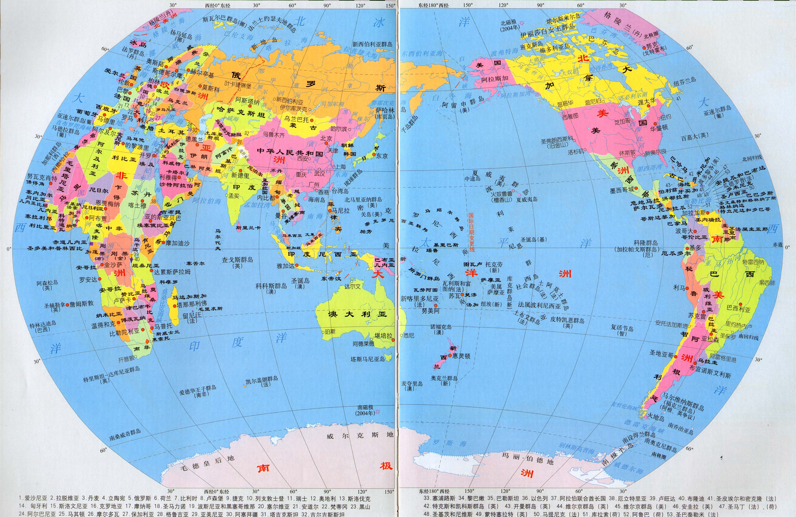

---
最近在学习ol3，学习进度很慢，想每天督促自己写点东西，做一个学习的记录

#最简单的例子#
	<!DOCTYPE html>
	<html>
	<head>
		<title></title>
		
	</head>
	<body>
	

	
	</body>
	</html>

###调用openlayers###
	
	

###
作为地图容器###
一个div必须有一个id，这个id是ol.Map实例化绑定的目标
###创建Map###
####step one 实例化map####
	var map = new ol.Map({ ... });
单纯的创造出了一个对象，一个空对象而已
####step two关联目标区域####
	target : 'map'//这里是一个div的id
####step three 加载图层####
	layers : [
		new ol.layer.Tile({
			source :new ol.source.OSM()
		})
	]
####step four视图设置####
	view: new ol.View({
      center: [0,0],
      zoom: 4
    })
   
