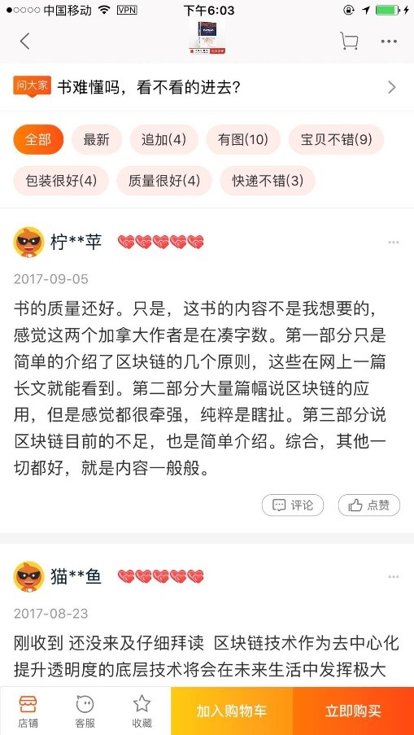

   -----IOS端竞品分析报告
汇报人：向福林
日期：2017-09-26

# 1 战略层 

## 1.1 行业描述 

根据Analysys易观发布的《中国移动网购市场季度监测报告2017年第2季度》数据显示，2017年第2季度，中国移动网购市场交易规模达12794.2亿元，同比增长45.9%。

 
2017年2季度，移动网购在线上零售占比持续扩张，交易总额的比重提升至80.4%。

&nbsp;&nbsp;&nbsp;&nbsp;&nbsp;&nbsp;&nbsp;&nbsp;&nbsp;&nbsp;&nbsp;&nbsp;&nbsp;&nbsp;&nbsp;&nbsp;&nbsp;&nbsp;&nbsp;&nbsp;&nbsp;&nbsp;&nbsp;&nbsp;&nbsp;&nbsp;&nbsp;&nbsp;&nbsp;&nbsp;&nbsp;&nbsp;&nbsp;&nbsp;&nbsp;&nbsp;&nbsp;&nbsp;&nbsp;&nbsp;&nbsp;&nbsp;&nbsp;&nbsp;&nbsp;&nbsp;&nbsp;&nbsp;&nbsp;&nbsp;&nbsp;&nbsp;&nbsp;&nbsp;&nbsp;&nbsp;&nbsp;&nbsp;&nbsp;&nbsp;（图片来自于Analysys易观）

2季度市场份额方面，整体格局保持稳定。手机淘宝+天猫市场以65.2%市场份额位居首位，手机京东市场份额19.5%位居第二，位居第三位为手机唯品会，其市场份额达到1.8%。

1季度市场份额方面，整体格局保持稳定。手机淘宝+天猫市场以80.5%市场份额位居首位， 手机京东市场份额13.4%位居第二位居第三位为手机唯品会，其市场份额达到2.0%。	

## 1.2 竞品选择

根据“综合电商”关键词搜索结果，淘宝、京东、天猫分列前三强，对综合电商佼佼者进行分析可以对电商行业进行详细的了解，同时，具有很强的借鉴指导作用
近半年来，淘宝、京东、天猫在移动端的搜索指数来看，由于京东的“618活动”等，给京东带来了成倍的搜索量。从而直接导致，京东在第二季度的移动网购市场交易的份额中增长6个百分点，达到近20%，天猫+淘宝由一季度的80%下降到65%，所以我认为这三者移动网购市场的前三强，所以对其进行竞品分析

### 1.2.1 产品定位

|对比项|淘宝|京东|
| ---- | ---- | ---- |
Slogan | 随时随地，想淘就淘 | 多·快·好·省（「这才是最直接最长情的告白」）
商业模式 | 为买卖双方提供一个在线交易平台。| 在线自营平台，统一采购并在线展示、出售商品，并通过物流直接交付给消费者
平台特征 | 大量接入C端用户，作为零售生态的连接 | 统一采购，保证品质
盈利模式 | 交易服务费、特色服务费、增值服务费，资金沉淀收入，广告|商家返点、薄利多销、虚拟店铺出租费、

### 1.2.2 用户定位

| ---- | ---- |
京东 | 以3C产品起家，对商品品质、物流体验都有较高要求，更多的是针对要求品质保障的都市白领或者3C用户
淘宝 | 品类大而全，品质参差不齐，更多针对对商品品质要求比较低的用户

### 1.2.3 用户分析

* 用户年龄

* 性别分布

据百度指数显示2017.09.01~2017.09.27这一区间的数据显示，20~39岁之间是移动电商的高频使用者，且在京东商城和天猫商城男性使用者较为突出，可能受到了Iphone8等3C产品上市的影响。
* 用户地域分析

通过对比，我们发现对于三大电商平台的使用者分布比较统一，都主要集中在华东、华南、华北地区

# 2 范围层

## 2.1 特色功能及亮点

+ 淘宝-> 微淘

* 通过微淘，可以进行客户关系管理，品牌传递，精准互动，基于位置的导购，及成交转化；
* 用户也可以通过微淘对介绍的商品进行一个了解

## 2.2 功能对比分析

### 2.2.1 搜索界面对比

|淘宝|京东|
| ---- | ---- |
 | 
搜索发现 | 热搜推荐
可以搜索店铺 | 支持拍照搜索，入口不在这里
支持搜索天猫 |

### 2.2.2 搜索结果对比

|淘宝|京东|
| ---- | ---- |
 | 
搜索结果数庞大，种类很多 | 拥有自营物流配送；
可以按照店铺等搜索； | 按照出版社、包装、折扣等进行筛选，便于用户选择
有淘攻略、挑尖货辅助功能，便于用户对比|

于此同时，淘宝的淘攻略收集了搜索内容相关的信息，形成了社区的概念，有部分用户是没有购买需求的，通过社区的信息，促进用户进行商品选购，有利于用户粘度的形成；而京东的满减等活动一直是可圈可点，直观上刺激用户进一步消费。

### 2.2.3 智能助理对比

|淘宝|京东|
| ---- | ---- |
 | 
阿里小蜜是电子商务领域的智能私人助理，基于阿里海量消费和商家数据，结合线上、线下的生活场景需求，以智能+人工的模式提供智能导购、服务、助理的拟人交互业务体验。 | 小咚是一款采用人工智能技术的智能助理，通过语义分析以及深度学习等技术，它可通过语音为用户提供物流查询、商品推荐、售后申请、闲聊对话等服务。

在物流查询等方面我没有感到明显的差异，但是在商品推荐上，个人认为阿里小蜜优与京东小咚，但是京东小咚的界面科技感十足。

### 2.2.4 评价界面对比

|淘宝|京东|
| ---- | ---- |
 | 

有客服入口 | 可以查看相似商品的评价
可立即购买 | 	可以看到所有点赞数
综合来看，京东的导流做的比较不错，UGC式的评论+同类商品评价，可以大大提高用户继续购买同类产品概率；同时，直接显示点赞数对用户也是一种肯定，有利于用户持续地输出内容优质的评论，建议淘宝开放点赞统计，直观的显示出来，没有想明白为什么天猫的评论如此简洁，是有其他考虑吗？

### 2.2.5 商品展示页对比

|淘宝|京东|
| ---- | ---- |
 | 
促销等信息明显 | 有简短的介绍；
有立即购买通道 | 分享功能显式出现

京东在单个商品的介绍页面没有立即购买的通道，从而增加了用户购买的复杂度，很有可能降低转换率；淘宝的详情、评价等信息是通过用户向下滑动逐渐展示的或者左右滑动非图片区可以在详情、评价、介绍之间来回切换，而京东通过显式引导左右滑动进行选择，相比之下，京东的划分清晰，更加人性化

### 2.2.6 订单页面对比

|淘宝|京东|
| ---- | ---- |
 | 
没有找到在哪里可以开具发票 | 	支付方式有在线支付、货到付款、公司转账；
可以匿名购买| 

京东自建物流，可以在很大程度上保证自营品牌的快递速度。这一点京东占有很大的优势，同时由于商业模式，淘宝平台不提供发票，而需要发票的话需要具体和商家进行商谈，这也体现了京东自营业务的优势，能保证很高的正品率。

# 3 结构层

## 3.1 产品结构分析

### 3.1.1 京东产品结构

 

### 3.1.2 淘宝产品结构

 

从宏观上来说，淘宝涉及的功能非常之多，涉及生活方方面面，而京东和天猫主要在电商零售上

# 4 框架层

 

* 都有扫一扫的功能；且有显示搜索框；搜索框右侧淘宝有牌照搜索的功能；
* 该区域作为用户的聚焦区，是每个APP都很看重的，将重要的功能都集中这一区域;
总结：手机淘宝、京东商城均采用Tab标签式的交互框架，各入口清晰，用户可以随意切换并随时跳转回来

# 5 表现层

* 电商平台的软件都会在有限的空间中尽可能的放置用户感兴趣的内容，三款软件的界面设计风格一致；
* 手机淘宝主要以橙色为主，而京东和天猫则是以暗色为主，在视觉上，暖色系的接受度要高一点，这一点也表明了淘宝针对的目标用户群体与后两者不一致，冷色系主要强调出高品质

# 总结

淘宝和京东商业模式的不同，决定了两家公司的基因差异，当前的淘宝更像是一个依托于电商的一个生态圈，涉及金融、旅游、社交、生活、保险、健康等众多方面，同时淘宝商品种类繁多，用户能有很多选择；
相比之下，京东同样在打造和零售相关的生态圈，仅仅围绕着零售的圈子进行布局，立志给用户提供最好的品质商品以及购物体验；
淘宝详情头图以及店铺首页支持视频，这是C2C最大的优势所在，具体内容由卖家产生，自己不产生内容，而京东要想将自营的商品都做成视频，又会有很大一部分开销，可以要求商家提供
	建议:手机淘宝将微淘功能在显眼的Tab页上，用户可以阅览潮流资讯，评达人穿搭，同时加入大量的UGC内容，京东也应该重视社交的重要性；

